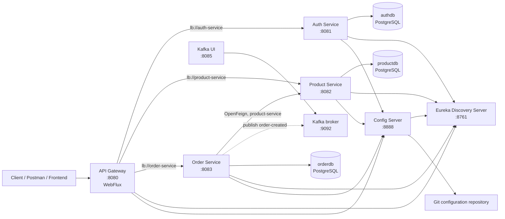
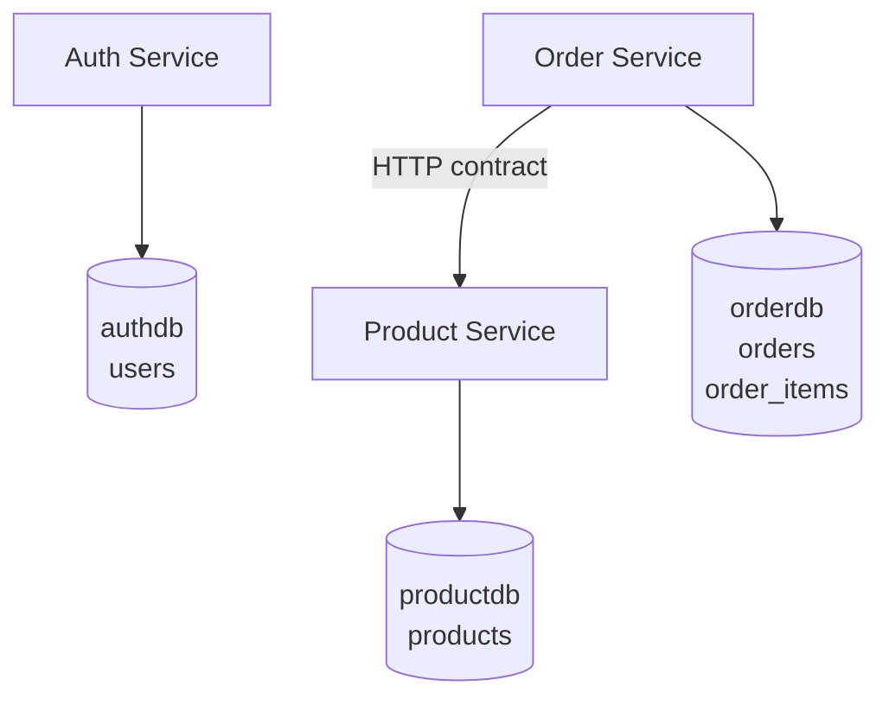
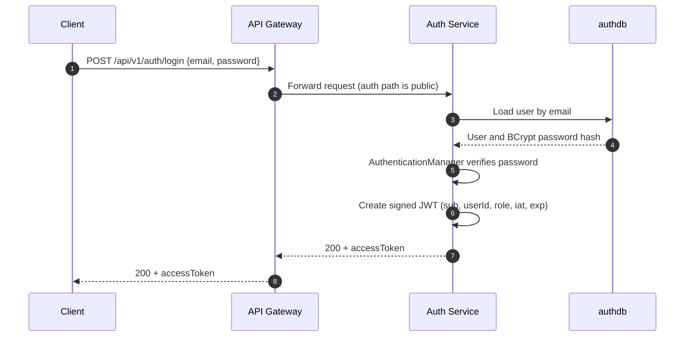
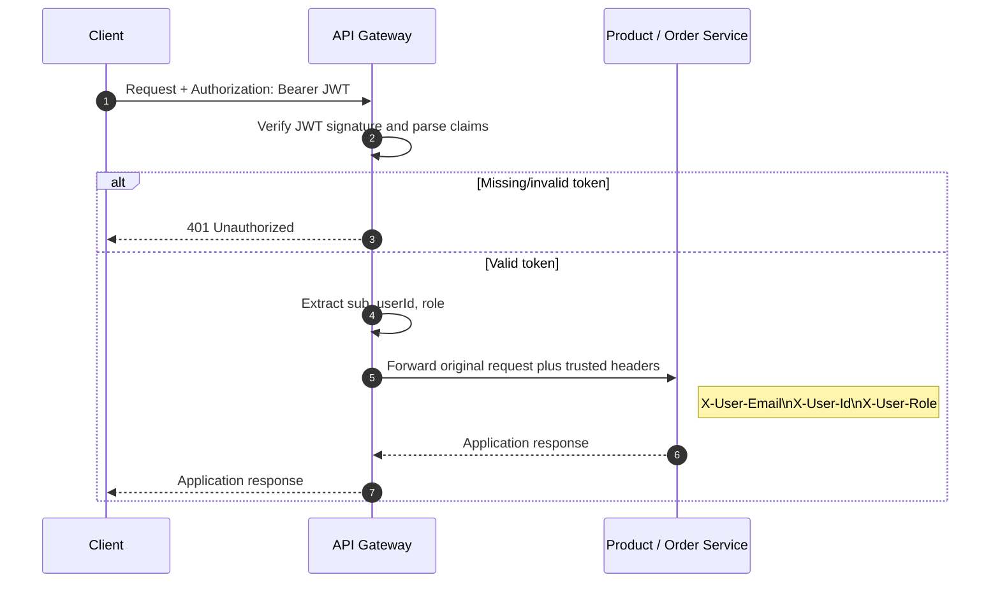
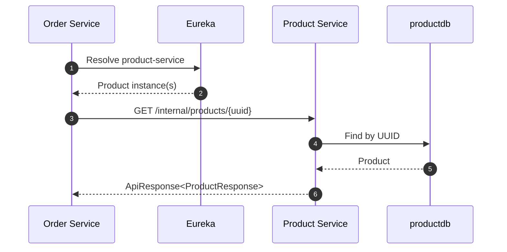
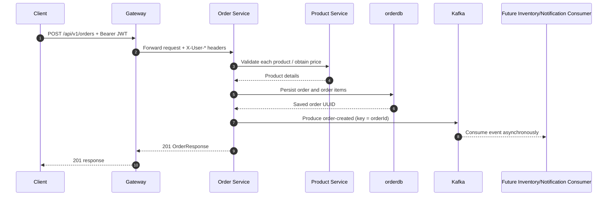
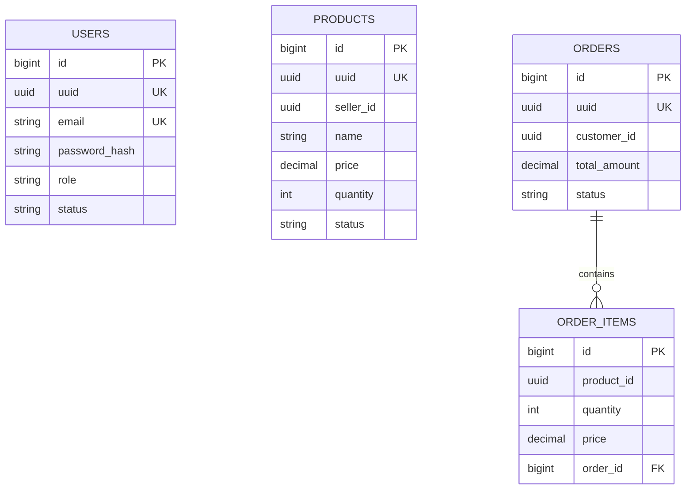
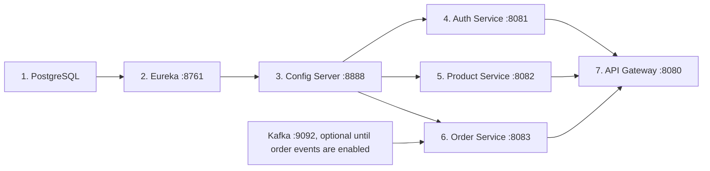

# ShopSphere — Project Documentation

> **Scope.** This document describes the code currently present in this repository. It distinguishes features that are implemented and executable from integrations that have been scaffolded but are not yet invoked by the application.

## 1. Project overview

ShopSphere is a Spring Boot microservices backend for an e-commerce domain. Its current capabilities are user registration/login, JWT-based request authentication at the gateway, role-based product management, product retrieval, service discovery, centralized configuration, and the foundations for creating orders and publishing order-created events.

The public entry point is the API Gateway at `http://localhost:8080`. Services use Eureka names rather than fixed service hostnames, and runtime configuration is retrieved from Spring Cloud Config.

### Implemented features

| Area | Feature | Status |
| --- | --- | --- |
| Identity | Register user, BCrypt password hashing, duplicate-email detection | Implemented |
| Identity | Login, signed JWT issuance, `/me` authenticated endpoint | Implemented |
| Gateway | Route requests by path, validate JWT signature, add trusted user headers | Implemented |
| Products | Create and read products; update/delete endpoint code | Create/read implemented; update/delete require the authorization fix noted below |
| Products | ADMIN/SELLER authorization for product mutations | Implemented |
| Products | Request validation and structured validation errors | Implemented |
| Orders | Order domain model and create-order HTTP endpoint | Scaffolded |
| Orders | Product lookup client using OpenFeign | Implemented; currently used by test endpoint |
| Orders | Kafka `OrderCreatedEvent` producer | Implemented; not called by `createOrder` yet |
| Platform | Eureka discovery and Config Server backed by a Git repository | Implemented |

## 2. Technology stack

| Concern | Technology used |
| --- | --- |
| Language/runtime | Java 21 |
| Application framework | Spring Boot 3.5.5 |
| Cloud platform | Spring Cloud 2025.0.0 |
| Edge routing | Spring Cloud Gateway Server WebFlux |
| Discovery | Netflix Eureka |
| Central configuration | Spring Cloud Config Server, Git-backed |
| HTTP APIs | Spring MVC (`spring-boot-starter-web`) in business services |
| Authentication | Spring Security, stateless JWT (JJWT 0.12.7) |
| Authorization | Custom annotation plus Spring AOP aspect |
| Persistence | Spring Data JPA, Hibernate, PostgreSQL |
| Service-to-service HTTP | Spring Cloud OpenFeign |
| Events | Spring for Apache Kafka |
| Mapping/boilerplate | MapStruct and Lombok |
| Containerized local Kafka | Docker Compose, Apache Kafka in KRaft mode, Kafka UI |
| Testing | Spring Boot Test, Spring Security Test (auth service), Reactor Test (gateway) |

## 3. Architecture

### 3.1 Service topology



### 3.2 Architectural responsibilities

| Component | Responsibilities |
| --- | --- |
| API Gateway | Public ingress, path routing, JWT verification, user-context propagation, request/response logging. |
| Auth Service | Owns users, password verification, JWT creation, and auth endpoints. |
| Product Service | Owns products and product authorization policy. It exposes public product APIs plus an internal product lookup endpoint. |
| Order Service | Owns orders/order items. It is intended to coordinate product lookup and order-created event publication. |
| Eureka | Registry used by gateway and Feign to resolve logical names such as `product-service`. |
| Config Server | Supplies service configuration from a separate Git repository. |
| Kafka | Planned asynchronous integration point for `order-created` events. |

### 3.3 Data ownership

Each service has its own PostgreSQL database. No service accesses another service's tables.



This is the correct microservice boundary: an order should obtain a product's current information through the Product Service API, not through a cross-database join.

## 4. Runtime configuration and ports

### 4.1 Local ports

| Component | Port | Source |
| --- | ---: | --- |
| API Gateway | 8080 | local `api-gateway/application.yaml` |
| Auth Service | 8081 | external config `auth-service.yml` |
| Product Service | 8082 | external config `product-service.yml` |
| Order Service | 8083 | local/external config |
| Kafka UI | 8085 | `kafka-compose.yml` |
| Config Server | 8888 | local `configserver/application.yaml` |
| Eureka | 8761 | local `discovery-server/application.yml` |
| Kafka | 9092 | `kafka-compose.yml` |

### 4.2 External configuration

The Config Server is configured with a Git URI. It supplies shared Eureka settings, individual PostgreSQL datasource settings, gateway routes, and JWT values. Service applications import it through:

```yaml
spring:
  config:
    import: configserver:http://localhost:8888
```

`auth-service` and `order-service` use `optional:configserver:...`; the gateway and product service currently require the Config Server.

**Security note:** do not commit production database passwords or JWT signing secrets to a public Git configuration repository. Use environment variables, a secret manager, or encrypted Config Server values before production use.

### 4.3 Gateway routes

| Incoming path | Target service |
| --- | --- |
| `/api/v1/auth/**` | `lb://auth-service` |
| `/api/v1/products/**` | `lb://product-service` |
| `/internal/products/**` | `lb://product-service` |
| `/api/v1/orders/**` | `lb://order-service` |

Routes do **not** use `StripPrefix` or `RewritePath`. The full path is forwarded, so controller mappings must include the same public path when accessed through the gateway.

## 5. Authentication and authorization

### 5.1 JWT contents

The Auth Service signs a JWT with a shared HMAC secret. A new token includes:

```json
{
  "sub": "user@example.com",
  "userId": "<user UUID>",
  "role": "ADMIN",
  "iat": 0,
  "exp": 0
}
```

`role` is singular. The value is one of `CUSTOMER`, `SELLER`, or `ADMIN`. Tokens are immutable: after a role change or a JWT claim change, log in again to obtain a new token.

### 5.2 Authentication request flow



### 5.3 Auth Service implementation steps

1. `POST /api/v1/auth/register` validates `RegisterRequest`.
2. `AuthServiceImpl.register` rejects an existing email, maps DTO to `User`, BCrypt-hashes the password, and stores the user in `authdb`.
3. `User.prePersist` creates a UUID and applies defaults (`CUSTOMER`, `ACTIVE`, email not verified) when values are absent.
4. `POST /api/v1/auth/login` invokes Spring Security's `AuthenticationManager`.
5. `DaoAuthenticationProvider` calls `CustomUserDetailsService` and compares the supplied password with the stored BCrypt hash.
6. `JwtService.generateToken` embeds the user UUID and role and signs the token.
7. Authenticated Auth Service endpoints, such as `GET /api/v1/auth/me`, use `JwtAuthenticationFilter` to load the user and put their authorities in Spring Security's context.

### 5.4 Gateway authentication and header propagation



The gateway's `JwtAuthenticationFilter` skips only `/api/v1/auth/**`. Every other route needs a bearer token. It adds `X-User-Email`, `X-User-Id`, and `X-User-Role` after validation.

Business services resolve these headers into a `CurrentUser` object using `HandlerMethodArgumentResolver`.

**Trust boundary:** direct calls to `8082`/`8083` bypass the gateway and do not receive those headers. In a production deployment, business-service ports should not be publicly reachable, and inbound client copies of `X-User-*` headers should be removed/overwritten at the gateway.

### 5.5 Product role authorization

```mermaid
flowchart TD
    R[POST /api/v1/products] --> GW[Gateway validates JWT]
    GW --> H[Gateway adds X-User-Role]
    H --> CU[Product CurrentUser resolver]
    CU --> AOP[@RequireRole aspect]
    AOP --> Q{Role ADMIN or SELLER?}
    Q -- No --> F[403: permission denied]
    Q -- Yes --> V[@Valid validates body]
    V -->|invalid| B[400 validation error map]
    V -->|valid| S[Save product in productdb]
    S --> OK[201 Created]
```

The custom `@RequireRole` annotation and `RoleAuthorizationAspect` guard product mutations. `ADMIN` and `SELLER` are permitted. `CUSTOMER` is denied with a structured 403 response. Create includes a `CurrentUser` parameter and therefore fits the aspect's current implementation. Update and delete need the `CurrentUser`/aspect fix documented in [Current gaps and recommended next steps](#13-current-gaps-and-recommended-next-steps).

## 6. Public API reference

All normal client traffic should use the gateway base URL: `http://localhost:8080`.

### 6.1 Auth endpoints

| Method | Path | Authentication | Purpose |
| --- | --- | --- | --- |
| POST | `/api/v1/auth/register` | Public | Create a user |
| POST | `/api/v1/auth/login` | Public | Obtain JWT |
| GET | `/api/v1/auth/me` | Bearer JWT | Return current email |

Register example:

```json
{
  "firstName": "Asha",
  "lastName": "Shah",
  "email": "asha@example.com",
  "password": "StrongPass123",
  "phoneNumber": "9999999999",
  "role": "SELLER"
}
```

Login example:

```json
{
  "email": "asha@example.com",
  "password": "StrongPass123"
}
```

### 6.2 Product endpoints

| Method | Path | Role | Purpose |
| --- | --- | --- | --- |
| GET | `/api/v1/products` | Any authenticated gateway user | List products |
| GET | `/api/v1/products/{uuid}` | Any authenticated gateway user | Get a product |
| POST | `/api/v1/products` | ADMIN or SELLER | Create a product |
| PUT | `/api/v1/products/{uuid}` | ADMIN or SELLER | Update a product; requires authorization fix before reliable use |
| DELETE | `/api/v1/products/{uuid}` | ADMIN or SELLER | Delete a product; requires authorization fix before reliable use |

Create product example:

```json
{
  "name": "Wireless Mouse",
  "description": "Ergonomic Bluetooth mouse",
  "price": 1299.00,
  "quantity": 25,
  "brand": "ShopSphere",
  "sellerId": "<seller UUID>"
}
```

Validation requires nonblank name/description/brand, price at least `0.01`, nonnegative quantity, and a seller UUID. Invalid bodies return an error map in `ValidationErrorResponse`.

The Product Service also exposes `GET /internal/products/{uuid}` for internal use. It is currently routeable through the gateway, but it should ultimately be restricted to trusted internal callers only.

### 6.3 Order endpoints

| Method | Path | Status | Purpose |
| --- | --- | --- | --- |
| POST | `/api/v1/orders` | Controller exists; service implementation incomplete | Intended order creation |
| GET | `/api/v1/orders/test/{uuid}` | Development/test endpoint | Calls Product Service via Feign |
| GET | `/api/v1/orders/test/header` | Development/test endpoint | Shows propagated user headers |

Intended create-order payload:

```json
{
  "items": [
    {
      "productId": "<product UUID>",
      "quantity": 2
    }
  ]
}
```

The request DTO validates that there is at least one item, each item has a product UUID, and quantity is positive.

## 7. Product management flow

```mermaid
sequenceDiagram
    autonumber
    participant Client
    participant Gateway
    participant Product as Product Service
    participant DB as productdb

    Client->>Gateway: POST /api/v1/products + Bearer JWT + JSON
    Gateway->>Gateway: Validate token; extract ADMIN/SELLER
    Gateway->>Product: Forward request + X-User-* headers
    Product->>Product: Resolve CurrentUser and enforce @RequireRole
    Product->>Product: Validate CreateProductRequest
    Product->>DB: INSERT product
    DB-->>Product: Persisted product + generated UUID/audit fields
    Product-->>Gateway: 201 ApiResponse<ProductResponse>
    Gateway-->>Client: 201 response
```

Product entity defaults are generated in `@PrePersist`: UUID and `ACTIVE` status. JPA auditing is enabled in the Product Service application, and the shared base entity carries created/updated timestamps.

## 8. OpenFeign product lookup flow

The Order Service is annotated with `@EnableFeignClients`. `ProductClient` declares a logical client named `product-service`:

```java
@FeignClient(name = "product-service")
interface ProductClient {
    @GetMapping("/internal/products/{uuid}")
    ApiResponse<ProductResponse> getProductById(UUID uuid);
}
```

Feign resolves `product-service` through Eureka; no product host or port is embedded in client code.



### Step-by-step: integrate Feign into real order creation

1. Keep `@EnableFeignClients` on `OrderServiceApplication`.
2. Use an internal Product Service endpoint that returns the product UUID, price, status, and available quantity.
3. Inject `ProductClient` into `OrderServiceImpl`.
4. For every `OrderItemRequest`, call `productClient.getProductById(productId)`.
5. Reject unavailable/inactive products and insufficient stock.
6. Copy the returned price into `OrderItem`; do not accept the price from the client.
7. Calculate `totalAmount` as the sum of `price × quantity`.
8. Persist the aggregate (`Order` plus cascading `OrderItem`s) in an order-service transaction.
9. Map the persisted aggregate to `OrderResponse`.
10. Add fault handling (timeouts, retries where safe, and a clear response when Product Service is unavailable).

## 9. Kafka order-created flow

### 9.1 Current implementation status

The Order Service has:

- the `spring-kafka` dependency;
- `OrderCreatedEvent` and `OrderItemEvent` message classes;
- `OrderProducer`, which writes keyed events to `order-created`;
- a local Kafka/Kafka UI compose file.

`OrderServiceImpl.createOrder` currently returns `null`; it does not save an order, construct an event, or call `orderProducer.publish`. There is also no Kafka consumer in this repository and no explicit Kafka client configuration in the checked-in Order Service configuration. Consequently, the diagram below is the intended integration path, not current end-to-end behavior.



### Step-by-step: complete Kafka integration

1. Start Kafka locally:

   ```bash
   docker compose -f kafka-compose.yml up -d
   ```

2. Add Kafka client configuration to `order-service.yml` in the config repository. At minimum, configure `spring.kafka.bootstrap-servers: localhost:9092` and JSON serialization for `OrderCreatedEvent`.
3. Implement order persistence and mapping in `OrderServiceImpl.createOrder`.
4. Build an `OrderCreatedEvent` from the saved order ID, total amount, and `CurrentUser.userId`.
5. Invoke `orderProducer.publish(event)` after the order has been persisted.
6. Create a consumer in the service that owns the next responsibility (for example, Inventory Service or Notification Service) using `@KafkaListener(topics = "order-created", groupId = "...")`.
7. Make consumers idempotent using `orderId`; Kafka can redeliver messages.
8. For production consistency, adopt the transactional outbox pattern: commit the order and an outbox record together, then publish the outbox record asynchronously. Do not rely solely on a database write followed by a non-transactional Kafka send.
9. Define retry, dead-letter topic, observability, and schema-evolution policies before relying on events for payment or inventory changes.

## 10. Database model



`users`, `products`, and `orders` live in separate databases and therefore are not foreign-key related across services. `order_items.order_id` is the local relational association in `orderdb`.

## 11. Running locally

### 11.1 Prerequisites

- JDK 21
- PostgreSQL with `authdb`, `productdb`, and `orderdb`, or equivalent datasource values in the config repository
- Git/network access for Config Server to clone its configured repository
- Docker (for Kafka, when testing events)

### 11.2 Startup order



Run each Maven module from its own directory:

```bash
./mvnw spring-boot:run
```

After any Java configuration/security/filter change, rebuild and restart the affected application. A running JVM does not automatically load the class written to `target/classes` unless a dev-reload tool is configured.

### 11.3 Smoke-test sequence

1. Register a user through `POST /api/v1/auth/register`.
2. Log in through `POST /api/v1/auth/login`; copy `data.accessToken`.
3. Call `GET /api/v1/auth/me` with `Authorization: Bearer <token>`.
4. Call `GET /api/v1/orders/test/header` with the same token to verify gateway header propagation.
5. Use an ADMIN or SELLER token to create a product.
6. Call `GET /api/v1/products` or `/api/v1/products/{uuid}` to retrieve it.
7. Call `GET /api/v1/orders/test/{productUuid}` to exercise the OpenFeign product lookup.

## 12. Response and error conventions

Successful business responses use an `ApiResponse<T>` shape:

```json
{
  "success": true,
  "message": "...",
  "data": {},
  "timestamp": "..."
}
```

Important error behavior:

| Situation | Expected status | Current handler |
| --- | ---: | --- |
| Invalid auth registration/login payload | 400 | Auth Service validation handler |
| Duplicate email | 409 | Auth Service `EmailAlreadyExistsException` handler |
| Invalid credentials | 401 | Auth Service `BadCredentialsException` handler |
| Missing/invalid bearer token at gateway | 401 | Gateway filter |
| CUSTOMER attempts product mutation | 403 | Product custom `AccessDeniedException` handler |
| Invalid product body with allowed role | 400 | Product validation error-map handler |
| Product not found | 404 | Product `ProductNotFoundException` handler |

## 13. Current gaps and recommended next steps

These are source-level observations, not implied implemented features.

1. **Complete order creation.** Implement product validation, price snapshotting, order persistence, response mapping, and event publication in `OrderServiceImpl.createOrder`.
2. **Configure Kafka explicitly.** Add producer/consumer serializers, broker address, retries, and topic configuration outside source code.
3. **Add consumers.** No service currently consumes `order-created`.
4. **Secure internal endpoints.** `/internal/products/**` is publicly routeable and product/order services currently permit broad paths. Restrict networking and use service-to-service authentication.
5. **Stop trusting client input for seller ownership.** Product creation accepts `sellerId` in the request. For SELLER users, derive it from `CurrentUser.userId` instead; allow ADMIN behavior only if explicitly required.
6. **Harden gateway header handling.** Remove any incoming `X-User-*` headers before adding claims-derived values.
7. **Add role enforcement to every protected mutation.** The product update/delete methods are annotated, but their signatures do not include `CurrentUser`; the current aspect searches method arguments for `CurrentUser`. Add it or refactor the aspect to read a trusted request/security context.
8. **Expand tests.** Current test classes are context-load tests. Add controller, security, gateway, Feign, JPA, and Kafka integration tests.
9. **Use migrations.** Replace `ddl-auto: update` with versioned migrations such as Flyway or Liquibase for repeatable deployments.
10. **Remove sensitive logging.** The gateway currently logs Authorization header/token values. Log metadata only, never the raw bearer token.
11. **Protect secrets.** Move the JWT signing secret and database passwords out of the Git-backed config repository.

## 14. Source map

| Concern | Key source locations |
| --- | --- |
| Gateway routing/authentication | `api-gateway/.../filter/JwtAuthenticationFilter.java`, external `api-gateway.yml` |
| Auth login/JWT | `auth-service/.../service/impl/AuthServiceImpl.java`, `security/JwtService.java` |
| Product API/authorization | `product-service/.../controller/ProductController.java`, `security/RoleAuthorizationAspect.java` |
| Product validation/errors | `product-service/.../dto/request/CreateProductRequest.java`, `exception/GlobalExceptionHandler.java` |
| Feign client | `order-service/.../client/ProductClient.java` |
| Kafka producer | `order-service/.../kafka/OrderProducer.java` |
| Order implementation point | `order-service/.../service/impl/OrderServiceImpl.java` |
| Local Kafka stack | `kafka-compose.yml` |
